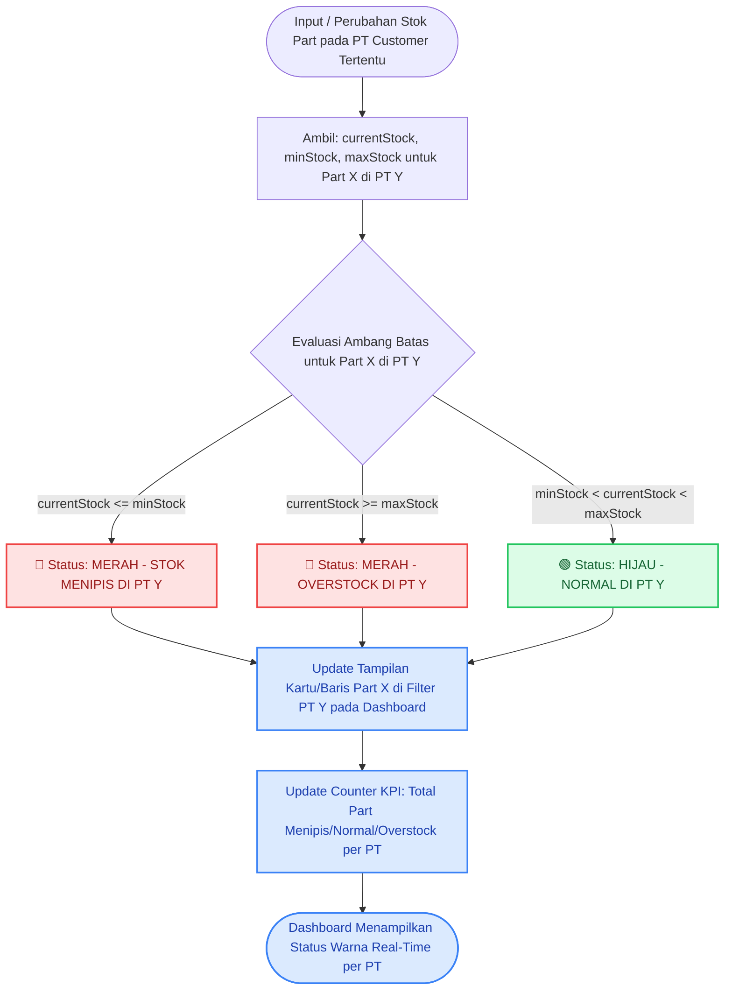
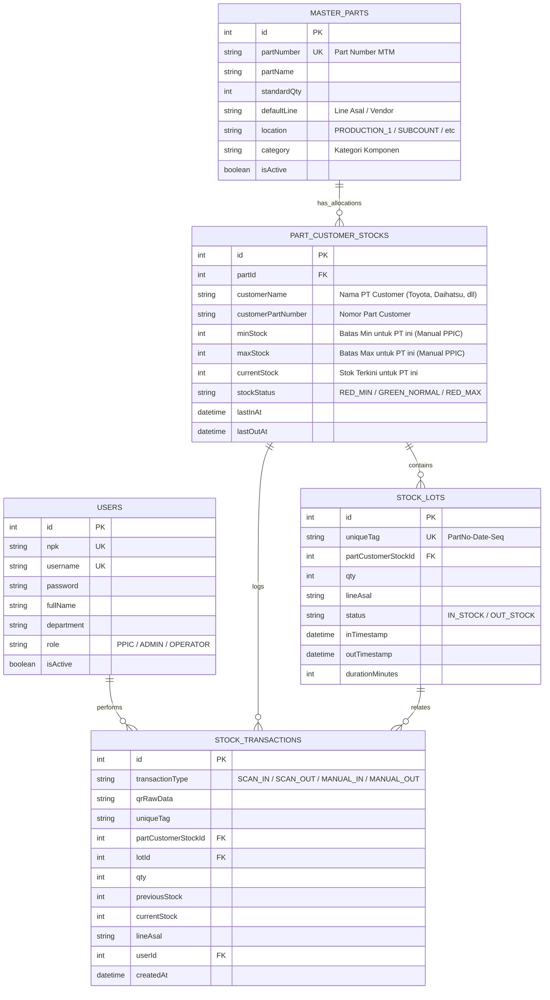

# DOKUMEN ANALISIS SISTEM MANAJEMEN & MONITORING STOK WHFG
## PT MENARA TERUS MAKMUR (MTM)

---

## 1. PENDAHULUAN & LATAR BELAKANG

Sistem ini dirancang khusus untuk memodernisasi dan mengotomatisasi proses pencatatan, pemantauan, serta pelacakan stok barang jadi (*Warehouse Finished Goods* / WHFG) di PT Menara Terus Makmur (MTM). Sistem ini mengintegrasikan pemindaian QR Code berbasis *handheld network scanner* (Zebra Scanner Gun) dengan sistem monitoring real-time berbasis web.

### Tujuan Utama:
1. **Akurasi Stok Real-time:** Menghilangkan pencatatan manual berbasis kertas dan menggantikannya dengan pemindaian barcode/QR code langsung saat barang masuk (*Scan IN*) dan keluar (*Scan OUT*).
2. **Early Warning System (Per Part & Per PT Customer):** Memberikan visibilitas instan kepada PPIC dan Supervisor terhadap status stok spesifik per Part Number untuk masing-masing PT Customer tujuan melalui sistem ambang batas (*Min/Max Threshold*) dengan indikator visual warna (Merah & Hijau).
3. **Statistik Pemantauan di Dashboard:** Menyajikan grafik dan visual statistik pergerakan stok langsung di dashboard monitoring untuk memantau tren operasional WHFG per part dan per PT.
4. **Stock Journey & Aging Traceability:** Melacak riwayat perjalanan stok (kapan barang masuk, berapa lama mengendap di WHFG, kapan keluar, tujuan PT, dan siapa operator yang menangani).
5. **Isolasi Transaksi Multi-Pintu:** Menjamin kelancaran operasional saat banyak operator melakukan pemindaian serentak dari berbagai line produksi internal maupun vendor/subcont eksternal.
6. **Mekanisme Backup Modul Laporan Komprehensif:** Menyediakan folder backup mandiri untuk 4 modul laporan lengkap (*ready-to-use*) agar siap diaktifkan kapan saja dibutuhkan tanpa membebani antarmuka operasional utama.

---

## 2. RUANG LINGKUP SISTEM (SCOPE & BOUNDARIES)

Berdasarkan dokumen analisis tanya-jawab (*Q&A Analysis Document*) dan penyesuaian aturan bisnis MTM, ruang lingkup dan batasan sistem dikunci sebagai berikut:

| Aspek | Status | Keterangan Dokumen Analisis |
|---|---|---|
| **Jenis Barang** | **Finished Goods (FG) Only** | Sistem hanya menangani barang jadi yang siap simpan/kirim. Tidak menangani bahan baku (*raw material*) atau barang setengah jadi (*WIP*). |
| **Kondisi Barang** | **Good Stock Only** | Sistem hanya mencatat barang dalam kondisi baik (*good stock*). Barang rusak/reject tidak diproses di sistem ini. |
| **Proses Retur** | **Out of Scope** | Karena barang adalah FG yang diproduksi dan disiapkan untuk customer, tidak ada proses retur customer dalam sistem ini. |
| **Integrasi ERP** | **Standalone System** | Sistem berdiri sendiri (*standalone*) via REST API HTTPS. Tidak ada integrasi langsung ke SAP/Oracle. |
| **Pencetakan QR** | **External / Vendor** | Pembuatan dan pencetakan label QR Code dilakukan oleh sistem/program lain. Tugas sistem ini murni membaca (*scan*) dan memvalidasi data QR. |
| **Penerimaan Melebihi Max** | **Tetap Bisa Masuk (Non-blocking)** | Stok akan **tetap bisa masuk** (Scan IN berhasil) walaupun jumlah stok sudah melebihi batas Max. Batas Max **hanya berfungsi sebagai peringatan warna merah di Dashboard**, bukan pembatas fisik penerimaan. |
| **Aturan Warning Stok** | **Per Part & Per PT Customer** | Peringatan ambang batas Min/Max dan indikator warna merah/hijau berlaku **spesifik per Part Number untuk masing-masing PT Customer** tujuan (misal Part X untuk PT Toyota vs PT Daihatsu memiliki Min/Max dan stok terpisah). |
| **Statistik Dashboard** | **Monitoring Only** | Tampilan statistik dan grafik disajikan di Dashboard murni untuk kebutuhan pemantauan visual (*monitoring*). |
| **Fitur Laporan Lengkap** | **Disimpan di Folder Backup** | Fitur laporan detail (4 jenis rekapitulasi data & export Excel) disimpan sebagai modul backup mandiri di `backup-features/reports/` yang siap diaktifkan kapan saja. |
| **Selisih Fisik** | **Out of Scope** | Sistem mencatat transaksi aktual pemindaian. Penanganan selisih fisik gudang di luar tanggung jawab sistem ini. |
| **Perangkat Scanner** | **Zebra Scanner Gun** | Menggunakan scanner Zebra yang terhubung ke jaringan (WiFi/LAN) via keyboard emulation / barcode listener. |
| **Umpan Balik Scanner** | **Teks Sederhana** | Layar scanner hanya menampilkan teks: **"Berhasil"** (sukses) atau **"Gagal"** (ditolak/duplikat/error). Jika di-scan dua kali, sistem menampilkan **"Gagal karena sudah discan"**. |
| **Bahasa Antarmuka** | **Bahasa Indonesia** | Seluruh antarmuka pengguna menggunakan Bahasa Indonesia. |

---

## 3. ANALISIS DATA MASTER

### 3.1. Analisis Data Master Parts (`DATA MASTER PARTS MTM`)
Berdasarkan data master aktual per 23 September 2026, terdapat **481 Part Number**.

#### A. Struktur Kolom Data Master Parts
1. `Part Number`: Kode unik internal MTM (contoh: `MFMSTR-FHFD28A000`, `MTTOOL-SPL9RESTWA`, `MFFHOU-F00D4AB020`).
2. `Part Name`: Deskripsi nama part (contoh: `TIRE WRENCH, 19 RE SH (PLATTED)`, `HANDLE, SPW 200 SE`).
3. `Job Number`: Nomor pekerjaan produksi (opsional).
4. `Customer Number`: Nomor part customer (contoh: `43502-BZ230-00`, `IRM-8979578811`, `13261-12014-AA8`).
5. `Standard Qty`: Kuantitas standar per box/kanban (rentang nilai: 1 s/d 660 pcs, misal 20, 24, 40, 50, 100, 200, 330, 660).
6. `Affiliated Customers (Daftar PT Customer)`: 32 entitas PT Customer tujuan, antara lain:
   - *PT. Toyota Motor Manufacturing Indonesia (TMMIN)*
   - *PT. Toyota Astra-Motor Service (TAM)*
   - *PT. Astra Daihatsu Motor (ADM)*
   - *PT. Isuzu Astra Motor Indonesia (IAMI)*
   - *PT. Honda Prospect Motor (HPM)*
   - *PT. Suzuki Indomobil Motor (SIM)*
   - *PT. Aisin Indonesia, PT. Kayaba Indonesia, PT. Kubota Indonesia, PT. Mitsubishi Motors, dll.*
7. `Line Asal`: Line produksi internal maupun vendor/subcont penyedia part (36 entitas unik).
8. `Location`: Area lokasi gudang/produksi (`PRODUCTION_1`, `PRODUCTION_2`, `SUBCOUNT`, `MPI`).

#### B. Relasi Part vs PT Customer (Multi-PT Allocation)
Sebanyak 82+ part number terafiliasi dengan lebih dari satu PT Customer. Contoh kasus:
- Part `MTTOOL-SPLHS87000`: Digunakan oleh **PT. TOYOTA MOTOR MANUFACTURING** dan **PT. TOYOTA ASTRA-MOTOR SERVICE**.
- Part `MTTOOL-SPL9REHTWA`: Digunakan oleh **PT. HONDA PROSPECT MOTOR**, **PT. SUZUKI INDOMOBIL MOTOR**, dan **PT SUZUKI INDOMOBIL SALES**.
- **Konsekuensi Bisnis:** Masing-masing PT Customer memiliki kebutuhan stok, batas Min, batas Max, dan alokasi stok terpisah.

---

### 3.2. Analisis Struktur QR Code Plain Text MTM

Format data QR Code yang dicetak mengikuti struktur plain text terstandar dengan delimiter pipe (`|`):

```
[PartNumber]|[CustomerPartNumber]|[StandardQty]|[Line/JobCode]|[Date/Lot]|[SequenceNumber]
```

#### Contoh Riil Data QR:
| No | Raw QR Code Plain Text | Part Number | Cust Part Number | Qty | Line/Job | Date | Sequence |
|---|---|---|---|---|---|---|---|
| 1 | `MFMSTR-FHFD28A000\|43502-BZ230-00\|4\|22092026\|0001` | MFMSTR-FHFD28A000 | 43502-BZ230-00 | 4 | - | 22092026 | 0001 |
| 2 | `MTTOOL-SPL9RESTWA\|IRM-8979578811\|24\|-\|14022026\|0012` | MTTOOL-SPL9RESTWA | IRM-8979578811 | 24 | - | 14022026 | 0012 |
| 3 | `MFMHUB-F00TRH2000\|321515-50330\|40\|EH45\|09022026\|0005` | MFMHUB-F00TRH2000 | 321515-50330 | 40 | EH45 | 09022026 | 0005 |
| 4 | `MFFHOU-F00SL00000\|MB092723\|300\|-\|17042026\|0042` | MFFHOU-F00SL00000 | MB092723 | 300 | - | 17042026 | 0042 |

---

### 3.3. Analisis Data Master User (`users-export.csv`)
Terdapat **523 User** dalam database MTM dengan rincian departemen/role:

| Role / Departemen | Jumlah User | Hak Akses Sistem |
|---|---|---|
| **PPIC** | Terdaftar | **Full Access**: Master Parts, Pengaturan Min/Max per Part & per PT, Monitoring Dashboard, Analisis Aging. |
| **ADMIN** | Terdaftar | **Full Access**: Konfigurasi Sistem, User Management, Master Data, Audit Log. |
| **PRODUCTION_I / PRODUCTION_II** | Terdaftar (Mayoritas) | **Operator Scan**: Scan IN, Scan OUT, Input Manual Fallback, Cek Riwayat Scan. |
| **QUALITY_ASSURANCE / PROCESS_ENG** | Terdaftar | **Read-Only / Monitoring**: Akses Dashboard Monitoring & Tracking Part. |

---

## 4. FLOWCHART SISTEM & DIAGRAM ALUR PROSES

### 4.1. End-to-End System Flowchart (Bagan Alur Keseluruhan Sistem)

```mermaid
flowchart TD
    subgraph Aktor ["Aktor & Antarmuka"]
        OP["Operator Pulling (Zebra Scanner / Handheld)"]
        PPIC["User PPIC / Admin (Web Desktop)"]
    end

    subgraph Modul_Scan ["Modul Operasional Scan & Fallback"]
        START_SCAN{"Pilih Aksi Operasional"}
        OP --> START_SCAN
        START_SCAN -->|Scan Barcode/QR| SCAN_ACTION["Scan QR via Zebra Scanner"]
        START_SCAN -->|QR Rusak/Sobek| MANUAL_ACTION["Input Manual (5 Field Wajib)"]
        
        SCAN_ACTION --> PARSE_QR["Parse QR Plain Text: PartNo | CustNo | Qty | Date | Seq"]
        PARSE_QR --> CHECK_TYPE{"Tipe Transaksi"}
        MANUAL_ACTION --> CHECK_TYPE
    end

    subgraph Backend_Process ["NestJS Backend & PostgreSQL (Atomic Transaction)"]
        CHECK_TYPE -->|IN / Masuk| IN_FLOW["Proses Scan IN"]
        CHECK_TYPE -->|OUT / Keluar| OUT_FLOW["Proses Scan OUT"]

        IN_FLOW --> CHECK_DUP_IN{"Apakah QR sudah berstatus IN_STOCK?"}
        CHECK_DUP_IN -->|Ya: Duplikat Scan| REJECT_IN["Tolak Transaksi: 'Gagal karena sudah discan'"]
        CHECK_DUP_IN -->|Tidak: Valid (Walau > Max)| COMMIT_IN["Atomic INSERT StockLot & UPDATE PartCustomerStock (+Qty)"]

        OUT_FLOW --> CHECK_STOCK_OUT{"Apakah Stok Part di PT Cukup & Status IN_STOCK?"}
        CHECK_STOCK_OUT -->|Tidak / Sudah OUT| REJECT_OUT["Tolak Transaksi: 'Gagal karena sudah discan' / Stok Kosong"]
        CHECK_STOCK_OUT -->|Ya: Valid| COMMIT_OUT["Atomic UPDATE StockLot (OUT) & PartCustomerStock (-Qty)"]
        COMMIT_OUT --> CALC_AGING["Hitung Durasi Simpan (Dwell Time = Waktu OUT - Waktu IN)"]
    end

    subgraph Output_Scanner ["Umpan Balik Scanner Zebra"]
        REJECT_IN --> FB_FAIL["Tampilan Layar: GAGAL (Gagal karena sudah discan)"]
        REJECT_OUT --> FB_FAIL
        COMMIT_IN --> FB_SUCCESS["Tampilan Layar: BERHASIL"]
        COMMIT_OUT --> FB_SUCCESS
    end

    subgraph PPIC_Module ["Modul PPIC & Monitoring"]
        PPIC --> MASTER_VIEW["Master Part Management (Kategori / PT Customer / Line)"]
        MASTER_VIEW --> SET_MINMAX["Input Manual Nilai Min & Max (Per Part & Per PT)"]
        SET_MINMAX --> EVAL_THRESHOLD["Evaluasi Ambang Batas Stok Per Part & Per PT"]
        
        COMMIT_IN --> EVAL_THRESHOLD
        COMMIT_OUT --> EVAL_THRESHOLD

        EVAL_THRESHOLD --> DASHBOARD["Dashboard Monitoring Stok WHFG (Filter per PT Customer)"]
        DASHBOARD --> COLOR_RED["🔴 Merah: Stok <= Min ATAU Stok >= Max (Per PT)"]
        DASHBOARD --> COLOR_GREEN["🟢 Hijau: Min < Stok < Max (Per PT)"]
        DASHBOARD --> STATS_VIEW["📊 Statistik Pantauan Stok (IN/OUT, Status Dist, Share per PT)"]
        
        CALC_AGING --> TRACKING_VIEW["Halaman Stock Journey & Aging Timeline"]
        DASHBOARD --> TRACKING_VIEW
    end

    subgraph Backup_Module ["Folder Backup Modul Laporan (4 Output Laporan)"]
        BACKUP_DIR["📁 backup-features/reports/"]
        BACKUP_DIR --> R1["1. Laporan Mutasi & Pergerakan Stok Bulanan per PT"]
        BACKUP_DIR --> R2["2. Laporan Riwayat Transaksi & Audit Log"]
        BACKUP_DIR --> R3["3. Laporan Evaluasi Stok Kritis & Overstock per PT"]
        BACKUP_DIR --> R4["4. Laporan Rata-rata Lama Simpan (Aging/Dwell Time)"]
    end

    classDef redStyle fill:#fee2e2,stroke:#ef4444,stroke-width:2px,color:#991b1b;
    classDef greenStyle fill:#dcfce7,stroke:#22c55e,stroke-width:2px,color:#166534;
    classDef blueStyle fill:#dbeafe,stroke:#3b82f6,stroke-width:2px,color:#1e40af;
    classDef yellowStyle fill:#fef9c3,stroke:#eab308,stroke-width:2px,color:#854d0e;
    classDef purpleStyle fill:#f3e8ff,stroke:#a855f7,stroke-width:2px,color:#6b21a8;

    class COLOR_RED,FB_FAIL,REJECT_IN,REJECT_OUT redStyle;
    class COLOR_GREEN,FB_SUCCESS,COMMIT_IN,COMMIT_OUT greenStyle;
    class DASHBOARD,TRACKING_VIEW,MASTER_VIEW,STATS_VIEW blueStyle;
    class CHECK_DUP_IN,CHECK_STOCK_OUT,CHECK_TYPE,START_SCAN yellowStyle;
    class BACKUP_DIR,R1,R2,R3,R4 purpleStyle;
```

---

### 4.2. Flowchart Logika Peringatan Status Warna Stok Per Part & Per PT Customer



---

## 5. PROSES BISNIS & LOGIKA OPERASIONAL

### 5.1. Alur Scan IN (Penerimaan Barang Jadi ke WHFG)
1. Operator di pintu penerimaan (Pintu Line Internal atau Pintu Vendor Eksternal) mengarahkan scanner Zebra ke QR Code pada box/kanban.
2. Aplikasi scanner mengirim request `POST /api/scan/in` berisi data QR plain text.
3. Backend memverifikasi:
   - Apakah QR valid dan part number terdaftar di master part?
   - Mengidentifikasi PT Customer tujuan berdasarkan data barcode / master alokasi.
   - **Anti-Duplikasi:** Apakah barcode/kanban ini dengan `UniqueTag` yang sama sudah pernah di-Scan IN dan masih berstatus `IN_STOCK`?
     - **Jika Ya (Scan Kedua Kali / Duplikat):** Sistem langsung menolak dan mengembalikan status **"Gagal"** dengan keterangan: **"Gagal karena sudah discan"**.
     - **Jika Tidak (Valid):** Transaksi dilanjutkan. **Catatan:** Penerimaan tetap berhasil walaupun stok melebihi batas Max.
4. Backend menambahkan stok pada tabel `PartCustomerStock` (stok part untuk PT terkait) dan mencatat detail di `StockLot` serta `StockTransaction`.
5. Evaluasi status stok per part & per PT diperbarui (Merah/Hijau).
6. Layar scanner Zebra menampilkan teks **"Berhasil"**.

---

### 5.2. Alur Scan OUT (Pengeluaran Barang Jadi / Pulling)
1. Operator Pulling melakukan scan QR box yang akan ditarik/dikirim untuk PT Customer tertentu.
2. Request `POST /api/scan/out` dikirim ke backend.
3. Backend memvalidasi ketersediaan stok pada part dan PT terkait.
4. Backend mengurangi stok aktual dan mencatat `outTimestamp`.
5. Status durasi penyimpanan (*dwell time*) dihitung otomatis (`outTimestamp - inTimestamp`).
6. Layar scanner menampilkan teks **"Berhasil"**.

---

### 5.3. Fallback Input Manual (Jika QR Rusak / Sobek)
Jika label QR Code rusak atau tidak terbaca oleh scanner Zebra, operator dapat menggunakan tombol **Input Manual**.

#### Form Input Manual Wajib Memuat 5 Parameter:
1. **`Part Number`**: Pilihan Part Number dari master part MTM.
2. **`Qty`**: Jumlah kuantitas fisik yang dimasukkan/dikeluarkan.
3. **`Status`**: Tipe transaksi (`IN` atau `OUT`).
4. **`Line Asal / PT Tujuan`**: Asal barang (Line Internal / Vendor Eksternal) dan PT Customer.
5. **`Waktu Manual`**: Tanggal dan jam pencatatan manual (default timestamp saat ini).

---

## 6. ATURAN AMBANG BATAS (PER PART & PER PT), STATISTIK DASHBOARD & BACKUP LAPORAN

### 6.1. Input Nilai Min & Max Manual oleh PPIC (Per Part & Per PT)
- Nilai ambang batas **Min Stock** dan **Max Stock** diinput secara **manual per Part Number untuk masing-masing PT Customer** oleh user PPIC/Admin.
- Contoh:
  - Part `MTTOOL-SPLHS87000` untuk `PT. TOYOTA MOTOR MANUFACTURING` $\rightarrow$ Min: 50, Max: 200
  - Part `MTTOOL-SPLHS87000` untuk `PT. TOYOTA ASTRA-MOTOR SERVICE` $\rightarrow$ Min: 20, Max: 80
  - Part `MTTOOL-SPL9REHTWA` untuk `PT. HONDA PROSPECT MOTOR` $\rightarrow$ Min: 100, Max: 400
  - Part `MTTOOL-SPL9REHTWA` untuk `PT. SUZUKI INDOMOBIL MOTOR` $\rightarrow$ Min: 60, Max: 250

### 6.2. Logika Peringatan Status Warna (Khusus Stok Saja Per Part & Per PT)
Status visual dihitung per kombinasi (Part, PT Customer):

$$\text{Status Stok}(part, PT) = \begin{cases} 
\color{red}\textbf{MERAH (Warning)} & \text{jika } \text{Stok}(part, PT) \le \text{Min}(part, PT) \quad (\text{Stok Menipis di PT tsb}) \\
\color{red}\textbf{MERAH (Warning)} & \text{jika } \text{Stok}(part, PT) \ge \text{Max}(part, PT) \quad (\text{Overstock di PT tsb}) \\
\color{green}\textbf{HIJAU (Normal)} & \text{jika } \text{Min}(part, PT) < \text{Stok}(part, PT) < \text{Max}(part, PT) \quad (\text{Stok Aman di PT tsb})
\end{cases}$$

### 6.3. Tampilan Dashboard Monitoring & Filter Per PT
- **Filter Utama PT Customer:** Dropdown / Tab pilihan PT Customer (*Semua PT, PT Toyota, PT Daihatsu, PT Isuzu, PT Honda, PT Suzuki, dll.*).
- **Tabel Monitoring Stok:** Menampilkan daftar part dengan kolom: *Part Number, Part Name, PT Customer, Customer Part No, Batas Min, Batas Max, Current Stock, Status Warna (🔴 Merah / 🟢 Hijau)*.
- **KPI Summary Cards per PT:** Menampilkan total part normal, kritis, dan overstock pada PT yang sedang dipilih.
- **Statistik Pemantauan Stok:** Grafik batang pergerakan IN/OUT harian dan diagram donat distribusi status stok.

### 6.4. Rincian 4 Hasil Laporan pada Folder Backup (`backup-features/reports/`)
1. **Laporan Mutasi & Pergerakan Stok Bulanan per PT:** Rekapitulasi kuantitas masuk, keluar, saldo akhir, dan status per Part dan per PT Customer.
2. **Laporan Riwayat Transaksi & Audit Log:** Jejak digital lengkap pemindaian operator beserta PT tujuan dan Line asal.
3. **Laporan Evaluasi Stok Kritis & Overstock per PT:** Daftar part yang menipis atau overstock di setiap PT Customer untuk bahan evaluasi jadwal PPIC.
4. **Laporan Rata-rata Lama Simpan (*Dwell Time*) per PT:** Analisis kecepatan perputaran stok (*Fast-Moving vs Slow-Moving*) per customer.

---

## 7. DESAIN ARSITEKTUR TEKNIS & DATABASE (ERD)

### 7.1. Technology Stack
- **Runtime:** Node.js v20 LTS
- **Frontend Framework:** Next.js (App Router, React 19, TypeScript)
- **Styling & UI:** Tailwind CSS, Lucide React, Recharts, SweetAlert2
- **Backend Framework:** NestJS (TypeScript)
- **Database & ORM:** PostgreSQL dengan Prisma ORM
- **Authentication:** JWT (JSON Web Token) dengan Role-Based Access Control (RBAC)

### 7.2. Entity Relationship Diagram (ERD)



---

## 8. STRUKTUR ENDPOINT REST API

| Method | Endpoint | Deskripsi | Hak Akses |
|---|---|---|---|
| `POST` | `/api/auth/login` | Login user menggunakan NPK & Password | Public |
| `GET` | `/api/auth/profile` | Ambil profil user yang sedang login | Authenticated |
| `POST` | `/api/scan/in` | Pemrosesan Scan IN QR Code (update stok Part pada PT terkait) | Operator, PPIC, Admin |
| `POST` | `/api/scan/out` | Pemrosesan Scan OUT QR Code | Operator, PPIC, Admin |
| `POST` | `/api/stock/manual` | Fallback Input Manual (PartNo, PT, Qty, Status, Line, Waktu) | Operator, PPIC, Admin |
| `GET` | `/api/stock/monitoring` | Ambil data stok per Part & per PT beserta status warna | All Roles |
| `GET` | `/api/stock/statistics` | Ambil data statistik pemantauan dashboard per PT | All Roles |
| `GET` | `/api/master-parts` | Ambil daftar 481 master parts & pengelompokan PT | All Roles |
| `PATCH`| `/api/master-parts/threshold/:id` | Input/update manual nilai Min & Max per Part & per PT | PPIC, Admin |
| `GET` | `/api/tracking/:query` | Ambil timeline riwayat perjalanan & durasi simpan | All Roles |
| `GET` | `/api/audit-logs` | Ambil riwayat audit log transaksi scan | PPIC, Admin |

---

## 9. KESIMPULAN

Dokumen analisis ini telah mengunci penyesuaian aturan bisnis bahwa ambang batas Min/Max dan peringatan warna stok dievaluasi **secara spesifik per Part Number dan per PT Customer**, mencakup 32 entitas PT Customer tujuan, alokasi stok multi-PT, penanganan multi-operator, format QR Code plain text, dan 4 jenis laporan di folder backup mandiri PT MTM.
