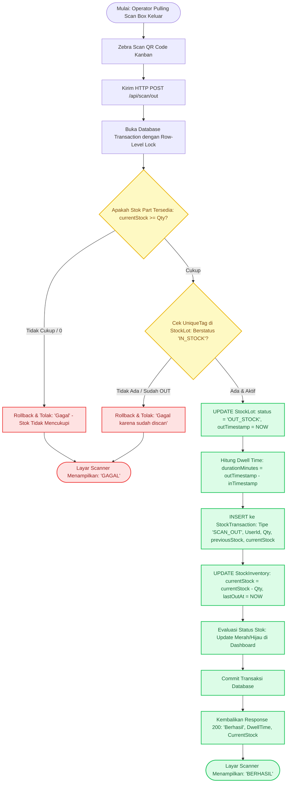
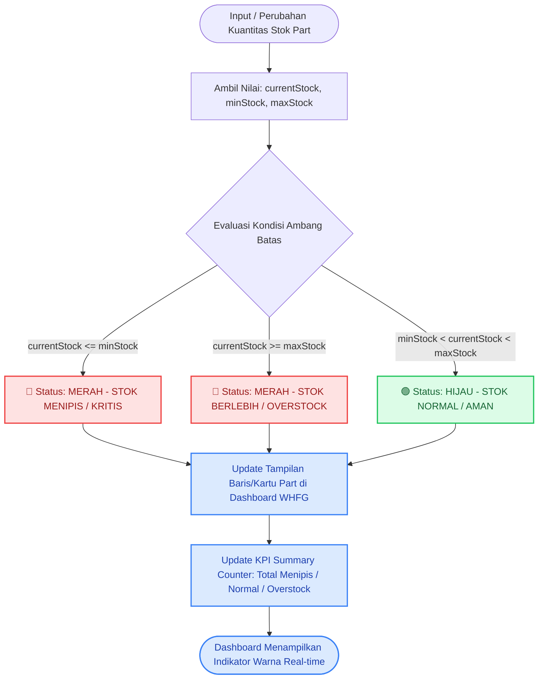
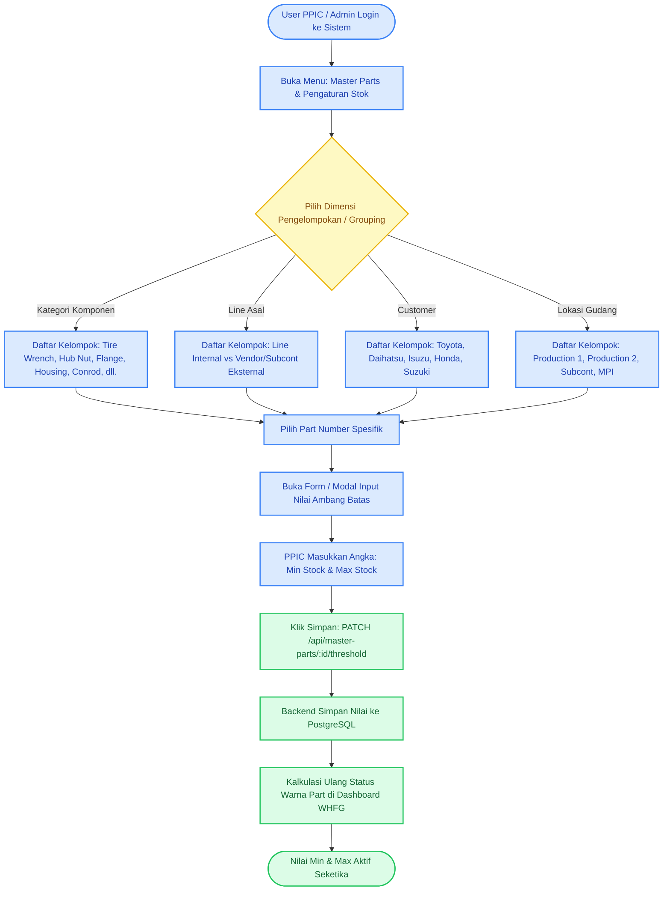
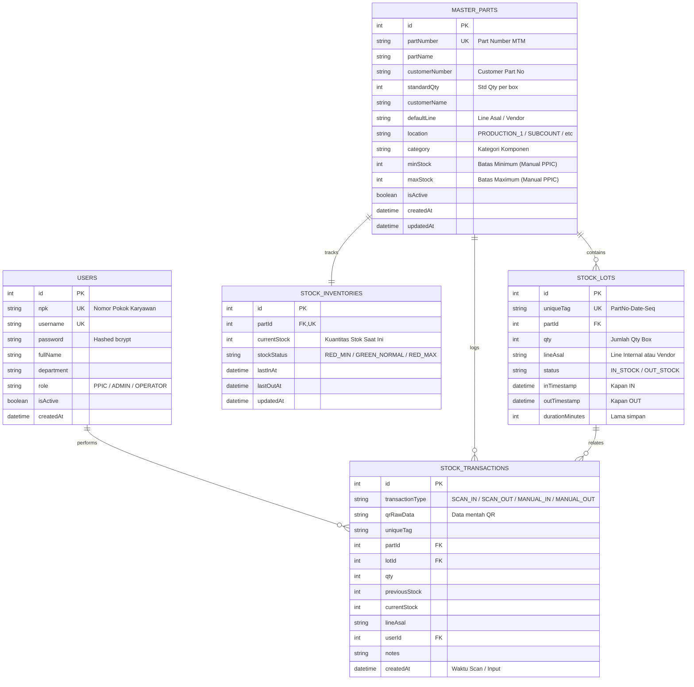

# DOKUMEN ANALISIS SISTEM MANAJEMEN & MONITORING STOK WHFG
## PT MENARA TERUS MAKMUR (MTM)

---

## 1. PENDAHULUAN & LATAR BELAKANG

Sistem ini dirancang khusus untuk memodernisasi dan mengotomatisasi proses pencatatan, pemantauan, serta pelacakan stok barang jadi (*Warehouse Finished Goods* / WHFG) di PT Menara Terus Makmur (MTM). Sistem ini mengintegrasikan pemindaian QR Code berbasis *handheld network scanner* (Zebra Scanner Gun) dengan sistem monitoring real-time berbasis web.

### Tujuan Utama:
1. **Akurasi Stok Real-time:** Menghilangkan pencatatan manual berbasis kertas dan menggantikannya dengan pemindaian barcode/QR code langsung saat barang masuk (*Scan IN*) dan keluar (*Scan OUT*).
2. **Early Warning System (Per Part):** Memberikan visibilitas instan kepada PPIC dan Supervisor terhadap status stok per part melalui sistem ambang batas (*Min/Max Threshold*) dengan indikator visual warna (Merah & Hijau).
3. **Stock Journey & Aging Traceability:** Melacak riwayat perjalanan stok (kapan barang masuk, berapa lama mengendap di WHFG, kapan keluar, dan siapa operator yang menangani).
4. **Isolasi Transaksi Multi-Pintu:** Menjamin kelancaran operasional saat banyak operator melakukan pemindaian serentak dari berbagai line produksi internal maupun vendor/subcont eksternal.

---

## 2. RUANG LINGKUP SISTEM (SCOPE & BOUNDARIES)

Berdasarkan dokumen analisis tanya-jawab (*Q&A Analysis Document*), ruang lingkup dan batasan sistem dikunci sebagai berikut:

| Aspek | Status | Keterangan Dokumen Analisis |
|---|---|---|
| **Jenis Barang** | **Finished Goods (FG) Only** | Sistem hanya menangani barang jadi yang siap simpan/kirim. Tidak menangani bahan baku (*raw material*) atau barang setengah jadi (*WIP*). |
| **Kondisi Barang** | **Good Stock Only** | Sistem hanya mencatat barang dalam kondisi baik (*good stock*). Barang rusak/reject tidak diproses di sistem ini. |
| **Proses Retur** | **Out of Scope** | Karena barang adalah FG yang diproduksi dan disiapkan untuk customer, tidak ada proses retur customer dalam sistem ini. |
| **Integrasi ERP** | **Standalone System** | Sistem berdiri sendiri (*standalone*) via REST API HTTPS. Tidak ada integrasi langsung ke SAP/Oracle. |
| **Pencetakan QR** | **External / Vendor** | Pembuatan dan pencetakan label QR Code dilakukan oleh sistem/program lain. Tugas sistem ini murni membaca (*scan*) dan memvalidasi data QR. |
| **Penerimaan Melebihi Max** | **Tetap Bisa Masuk (Non-blocking)** | Stok akan **tetap bisa masuk** (Scan IN berhasil) walaupun jumlah stok sudah melebihi batas Max. Batas Max **hanya berfungsi sebagai peringatan warna merah di Dashboard**, bukan pembatas fisik penerimaan. |
| **Selisih Fisik** | **Out of Scope** | Sistem mencatat transaksi aktual pemindaian. Penanganan selisih fisik gudang di luar tanggung jawab sistem ini. |
| **Perangkat Scanner** | **Zebra Scanner Gun** | Menggunakan scanner Zebra yang terhubung ke jaringan (WiFi/LAN) via keyboard emulation / barcode listener. |
| **Umpan Balik Scanner** | **Teks Sederhana** | Layar scanner hanya menampilkan teks: **"Berhasil"** (sukses) atau **"Gagal"** (ditolak/duplikat/error). Jika di-scan dua kali, sistem menampilkan **"Gagal karena sudah discan"**. |
| **Bahasa Antarmuka** | **Bahasa Indonesia** | Seluruh antarmuka pengguna menggunakan Bahasa Indonesia. |

---

## 3. ANALISIS DATA MASTER

### 3.1. Analisis Data Master Parts (`DATA MASTER PARTS MTM`)
Berdasarkan data master aktual per 23 September 2026, terdapat **481 Part Number**.

#### A. Struktur Kolom Data Master Parts
1. `Part Number`: Kode unik internal MTM (contoh: `MFMSTR-FHFD28A000`, `MTTOOL-SPL9RESTWA`, `MFFHOU-F00D4AB020`).
2. `Part Name`: Deskripsi nama part (contoh: `TIRE WRENCH, 19 RE SH (PLATTED)`, `HANDLE, SPW 200 SE`).
3. `Job Number`: Nomor pekerjaan produksi (opsional).
4. `Customer Number`: Nomor part customer (contoh: `43502-BZ230-00`, `IRM-8979578811`, `13261-12014-AA8`).
5. `Standard Qty`: Kuantitas standar per box/kanban (rentang nilai: 1 s/d 660 pcs, misal 20, 24, 40, 50, 100, 200, 330, 660).
6. `Affiliated Customers`: Daftar customer pengguna part:
   - *PT. Toyota Motor Manufacturing Indonesia (TMMIN)*
   - *PT. Astra Daihatsu Motor (ADM)*
   - *PT. Isuzu Astra Motor Indonesia (IAMI)*
   - *PT. Honda Prospect Motor (HPM)*
   - *PT. Suzuki Indomobil Motor / Sales (SIM)*
7. `Line Asal`: Line produksi internal maupun vendor/subcont penyedia part (36 entitas unik).
8. `Location`: Area lokasi gudang/produksi (`PRODUCTION_1`, `PRODUCTION_2`, `SUBCOUNT`, `MPI`).

#### B. Pengelompokan Master Part (*Part Categorization / Grouping*)
Untuk memudahkan user PPIC dalam menavigasi 481 part dan mengatur nilai Min/Max, part dikelompokkan dalam 4 dimensi:

1. **Pengelompokan Jenis Komponen (Component Category):**
   - *Tire Wrench* (Kunci Roda)
   - *Hub Nut & Nut Handle* (Mur Roda & Handle)
   - *Jack Handle & Lever* (Tuas Dongkrak)
   - *Rod Handle*
   - *Flange*
   - *Housing*
   - *Connecting Rod (Conrod)*
   - *Die Rolling & Tools*
   - *Pin Piston & Ball Race*
   - *Assy Components (Kick Starter, Cushion, Auto, Manual)*
2. **Pengelompokan Asal Barang (Line Produksi vs Vendor/Subcont):**
   - **Internal Lines:** `HF D80N`, `Hub Nut`, `Assy Auto`, `MPI -1`, `MPI -2`, `MPI -3`, `Conrod K60R`, `Pin Piston`, `Assy Cushion`, `Assy Kick Starter`, `Assy Manual`, `Assy SJ`, `LBJ 683 RH/LH`, `HF D14N`, `HF D34T`, `HF HPM`, dll.
   - **External Vendor / Subcont:** `PT BILGOS SEJAHTERA INDONESIA`, `PT PRIMA MUTU UNGGUL`, `PT. SAITAMA STAMPING INDONESIA`, `PT. ELEKTROPLATING SUPERINDO`, `PT. CGS INDONESIA`, `PT. BINTANG MATRIX INDONESIA`, `PT KARYA KOMPONEN PRESISI`, `PT. ADHI CHANDRA JAYA`, `PT. SURTECKARIYA INDONESIA`, `PT. MULTISTRADA MULIA`.
3. **Pengelompokan Customer:** Toyota Group, Daihatsu Group, Isuzu Group, Honda, Suzuki.
4. **Pengelompokan Lokasi:** `PRODUCTION_1`, `PRODUCTION_2`, `SUBCOUNT`, `MPI`.

---

### 3.2. Analisis Struktur QR Code Plain Text MTM

Format data QR Code yang dicetak mengikuti struktur plain text terstandar dengan delimiter pipe (`|`):

```
[PartNumber]|[CustomerPartNumber]|[StandardQty]|[Line/JobCode]|[Date/Lot]|[SequenceNumber]
```

#### Contoh Riil Data QR:
| No | Raw QR Code Plain Text | Part Number | Cust Part Number | Qty | Line/Job | Date | Sequence |
|---|---|---|---|---|---|---|---|
| 1 | `MFMSTR-FHFD28A000\|43502-BZ230-00\|4\|22092026\|0001` | MFMSTR-FHFD28A000 | 43502-BZ230-00 | 4 | - | 22092026 | 0001 |
| 2 | `MTTOOL-SPL9RESTWA\|IRM-8979578811\|24\|-\|14022026\|0012` | MTTOOL-SPL9RESTWA | IRM-8979578811 | 24 | - | 14022026 | 0012 |
| 3 | `MFMHUB-F00TRH2000\|321515-50330\|40\|EH45\|09022026\|0005` | MFMHUB-F00TRH2000 | 321515-50330 | 40 | EH45 | 09022026 | 0005 |
| 4 | `MFFHOU-F00SL00000\|MB092723\|300\|-\|17042026\|0042` | MFFHOU-F00SL00000 | MB092723 | 300 | - | 17042026 | 0042 |

#### Logika Parser QR Code:
1. Parsing token menggunakan separator `|`.
2. Pencocokan Part Number (Token 0) atau Customer Part Number (Token 1) ke database master part.
3. Kuantitas diambil dari Token 2 (jika kosong/0, gunakan `standardQty` dari master part).
4. Pembentukan **Tag Unik (Unique Tag)** untuk mekanisme anti-duplikasi:
   $$\text{UniqueTag} = \text{PartNumber} + \text{"-"} + \text{Date} + \text{"-"} + \text{SequenceNumber}$$
   *(Jika sequence number kosong, gunakan hash kombinasi QR + timestamp milidetik).*

---

### 3.3. Analisis Data Master User (`users-export.csv`)
Terdapat **523 User** dalam database MTM dengan rincian departemen/role:

| Role / Departemen | Jumlah User | Hak Akses Sistem |
|---|---|---|
| **PPIC** | Terdaftar | **Full Access**: Master Parts, Pengaturan Min/Max per part, Monitoring Dashboard, Analisis Aging, Laporan. |
| **ADMIN** | Terdaftar | **Full Access**: Konfigurasi Sistem, User Management, Master Data, Audit Log. |
| **PRODUCTION_I / PRODUCTION_II** | Terdaftar (Mayoritas) | **Operator Scan**: Scan IN, Scan OUT, Input Manual Fallback, Cek Riwayat Scan. |
| **QUALITY_ASSURANCE / PROCESS_ENG** | Terdaftar | **Read-Only / Monitoring**: Akses Dashboard Monitoring & Tracking Part. |

---

## 4. FLOWCHART SISTEM & DIAGRAM ALUR PROSES

### 4.1. End-to-End System Flowchart (Bagan Alur Keseluruhan Sistem)

Diagram berikut menggambarkan alur operasional menyeluruh antara aktor Operator Pulling, PPIC/Admin, pemrosesan transaksi independen, validasi scan, evaluasi ambang batas, hingga dashboard monitoring:

```mermaid
flowchart TD
    subgraph Aktor ["Aktor & Antarmuka"]
        OP["Operator Pulling (Zebra Scanner / Handheld)"]
        PPIC["User PPIC / Admin (Web Desktop)"]
    end

    subgraph Modul_Scan ["Modul Operasional Scan & Fallback"]
        START_SCAN{"Pilih Aksi Operasional"}
        OP --> START_SCAN
        START_SCAN -->|Scan Barcode/QR| SCAN_ACTION["Scan QR via Zebra Scanner"]
        START_SCAN -->|QR Rusak/Sobek| MANUAL_ACTION["Input Manual (5 Field Wajib)"]
        
        SCAN_ACTION --> PARSE_QR["Parse QR Plain Text: PartNo | CustNo | Qty | Date | Seq"]
        PARSE_QR --> CHECK_TYPE{"Tipe Transaksi"}
        MANUAL_ACTION --> CHECK_TYPE
    end

    subgraph Backend_Process ["NestJS Backend & PostgreSQL (Atomic Transaction)"]
        CHECK_TYPE -->|IN / Masuk| IN_FLOW["Proses Scan IN"]
        CHECK_TYPE -->|OUT / Keluar| OUT_FLOW["Proses Scan OUT"]

        IN_FLOW --> CHECK_DUP_IN{"Apakah QR sudah berstatus IN_STOCK?"}
        CHECK_DUP_IN -->|Ya: Duplikat Scan| REJECT_IN["Tolak Transaksi: 'Gagal karena sudah discan'"]
        CHECK_DUP_IN -->|Tidak: Valid (Walau > Max)| COMMIT_IN["Atomic INSERT StockLot & UPDATE StockInventory (+Qty)"]

        OUT_FLOW --> CHECK_STOCK_OUT{"Apakah Stok Cukup & Status IN_STOCK?"}
        CHECK_STOCK_OUT -->|Tidak / Sudah OUT| REJECT_OUT["Tolak Transaksi: 'Gagal karena sudah discan' / Stok Kosong"]
        CHECK_STOCK_OUT -->|Ya: Valid| COMMIT_OUT["Atomic UPDATE StockLot (OUT) & StockInventory (-Qty)"]
        COMMIT_OUT --> CALC_AGING["Hitung Durasi Simpan (Dwell Time = Waktu OUT - Waktu IN)"]
    end

    subgraph Output_Scanner ["Umpan Balik Scanner Zebra"]
        REJECT_IN --> FB_FAIL["Tampilan Layar: GAGAL (Gagal karena sudah discan)"]
        REJECT_OUT --> FB_FAIL
        COMMIT_IN --> FB_SUCCESS["Tampilan Layar: BERHASIL"]
        COMMIT_OUT --> FB_SUCCESS
    end

    subgraph PPIC_Module ["Modul PPIC & Monitoring"]
        PPIC --> MASTER_VIEW["Master Part Management (Kategori / Line / Cust)"]
        MASTER_VIEW --> SET_MINMAX["Input Manual Nilai Min & Max Per Part"]
        SET_MINMAX --> EVAL_THRESHOLD["Evaluasi Ambang Batas Stok Per Part (Monitoring Only)"]
        
        COMMIT_IN --> EVAL_THRESHOLD
        COMMIT_OUT --> EVAL_THRESHOLD

        EVAL_THRESHOLD --> DASHBOARD["Dashboard Monitoring Stok Real-Time WHFG"]
        DASHBOARD --> COLOR_RED["🔴 Merah: Stok <= Min ATAU Stok >= Max"]
        DASHBOARD --> COLOR_GREEN["🟢 Hijau: Min < Stok < Max"]
        
        CALC_AGING --> TRACKING_VIEW["Halaman Stock Journey & Aging Timeline"]
        DASHBOARD --> TRACKING_VIEW
    end

    classDef redStyle fill:#fee2e2,stroke:#ef4444,stroke-width:2px,color:#991b1b;
    classDef greenStyle fill:#dcfce7,stroke:#22c55e,stroke-width:2px,color:#166534;
    classDef blueStyle fill:#dbeafe,stroke:#3b82f6,stroke-width:2px,color:#1e40af;
    classDef yellowStyle fill:#fef9c3,stroke:#eab308,stroke-width:2px,color:#854d0e;

    class COLOR_RED,FB_FAIL,REJECT_IN,REJECT_OUT redStyle;
    class COLOR_GREEN,FB_SUCCESS,COMMIT_IN,COMMIT_OUT greenStyle;
    class DASHBOARD,TRACKING_VIEW,MASTER_VIEW blueStyle;
    class CHECK_DUP_IN,CHECK_STOCK_OUT,CHECK_TYPE,START_SCAN yellowStyle;
```

---

### 4.2. Flowchart Logika Scan IN & Anti-Duplikasi

Bagan alur detail validasi pemindaian barang masuk dan penanganan multi-operator/multi-pintu masuk (stok tetap dapat masuk meskipun kuantitas melebihi batas Max):

```mermaid
flowchart TD
    A([Mulai: Operator Arahkan Scanner Zebra]) --> B[Zebra Scan QR Code Plain Text]
    B --> C[Kirim HTTP POST /api/scan/in]
    C --> D[NestJS Controller Terima Request]
    D --> E[Parser Token QR: Split via delimiter '|']
    E --> F{Part Number Ada di Master Part?}
    
    F -->|Tidak Ada| G[Tolak: 'Gagal' - Part Tidak Terdaftar]
    F -->|Ada| H[Bentuk UniqueTag: PartNo + Date + Seq]
    
    H --> I[Buka Database Transaction: Read Committed + Row Lock]
    I --> J{Cek UniqueTag di Tabel StockLot: Status == 'IN_STOCK'?}
    
    J -->|Ya: Scan Kedua Kali / Duplikat| K[Rollback Transaksi]
    K --> L[Kembalikan Response 400: 'Gagal karena sudah discan']
    L --> M([Layar Scanner Menampilkan: 'GAGAL'])
    
    J -->|Tidak: Valid / Baru| N[INSERT ke Tabel StockLot: UniqueTag, PartId, Qty, LineAsal, inTimestamp]
    N --> O[INSERT ke Tabel StockTransaction: Tipe 'SCAN_IN', UserId, Qty]
    O --> P[UPDATE Tabel StockInventory: currentStock = currentStock + Qty]
    P --> Q[Hitung Status Stok untuk Dashboard: Merah jika <= Min / >= Max, Hijau jika di antaranya]
    Q --> R[Commit Transaksi Database]
    R --> S[Kembalikan Response 200: 'Berhasil', PartNo, Qty, CurrentStock]
    S --> T([Layar Scanner Menampilkan: 'BERHASIL'])

    classDef red fill:#fee2e2,stroke:#ef4444,stroke-width:2px,color:#991b1b;
    classDef green fill:#dcfce7,stroke:#22c55e,stroke-width:2px,color:#166534;
    classDef yellow fill:#fef9c3,stroke:#eab308,stroke-width:2px,color:#854d0e;

    class G,K,L,M red;
    class N,O,P,Q,R,S,T green;
    class F,J yellow;
```

---

### 4.3. Flowchart Logika Scan OUT & Perhitungan Aging (Dwell Time)

Bagan alur pengeluaran barang jadi dan kalkulasi durasi waktu mengendap di WHFG:



---

### 4.4. Flowchart Logika Peringatan Status Warna Stok Per Part (Dashboard Monitoring)

Bagan alur evaluasi peringatan visual spesifik per part yang tampil di dashboard monitoring:



---

### 4.5. Flowchart Pengelompokan Part & Input Manual Min/Max (PPIC)

Bagan alur navigasi pengelompokan 481 master part dan input manual nilai batas oleh PPIC:



---

## 5. PROSES BISNIS & LOGIKA OPERASIONAL

### 5.1. Alur Scan IN (Penerimaan Barang Jadi ke WHFG)
1. Operator di pintu penerimaan (Pintu Line Internal atau Pintu Vendor Eksternal) mengarahkan scanner Zebra ke QR Code pada box/kanban.
2. Aplikasi scanner mengirim request `POST /api/scan/in` berisi data QR plain text.
3. Backend memverifikasi:
   - Apakah QR valid dan part number terdaftar di master part?
   - **Anti-Duplikasi:** Apakah barcode/kanban ini dengan `UniqueTag` yang sama sudah pernah di-Scan IN dan masih berstatus `IN_STOCK`?
     - **Jika Ya (Scan Kedua Kali / Duplikat):** Sistem langsung menolak dan mengembalikan status **"Gagal"** dengan keterangan: **"Gagal karena sudah discan"** (atau **"Gagal, barcode sudah pernah discan"**).
     - **Jika Tidak (Valid):** Transaksi dilanjutkan. **Catatan:** Penerimaan tetap berhasil walaupun jumlah stok sudah melebihi batas Max.
4. Backend menambahkan stok pada tabel `StockInventory` dan mencatat detail di `StockLot` serta `StockTransaction`.
5. Evaluasi status stok per part diperbarui untuk monitoring Dashboard (Merah/Hijau).
6. Layar scanner Zebra menampilkan teks **"Berhasil"**.

---

### 5.2. Alur Scan OUT (Pengeluaran Barang Jadi / Pulling)
1. Operator Pulling melakukan scan QR box yang akan ditarik/dikirim.
2. Request `POST /api/scan/out` dikirim ke backend.
3. Backend memvalidasi:
   - Apakah stok part mencukupi ($currentStock \ge qty$)?
   - Apakah kanban ini tercatat berada di dalam gudang? Jika di-scan ulang saat sudah OUT, sistem menolak dengan pesan **"Gagal karena sudah discan"**.
4. Backend mengurangi stok aktual dan mencatat `outTimestamp`.
5. Status durasi penyimpanan (*dwell time*) dihitung otomatis (`outTimestamp - inTimestamp`).
6. Layar scanner menampilkan teks **"Berhasil"**.

---

### 5.3. Penanganan Concurrency & Multi-Operator / Multi-Pintu Masuk
Di lapangan MTM, terdapat banyak pintu masuk gudang (barang datang dari Line 1, Line 2, maupun vendor luar bersamaan).

#### Aturan Kunci Sesuai Dokumen:
> *"Jika Operator A sedang scan Barang 1 dan mengalami kendala, Operator B yang scan Barang 2 di waktu bersamaan tidak boleh terganggu."*

#### Solusi Arsitektur:
1. **Transaksi Terisolasi (Non-Blocking Transaction):**
   - Setiap scan diproses dalam blok transaksi independen di PostgreSQL menggunakan *Read Committed Isolation Level*.
   - Lock yang digunakan adalah *Row-Level Lock* spesifik pada baris part terkait (`SELECT FOR UPDATE`), bukan table-level lock.
2. **Kemandirian Transaksi:**
   - Scan Barang A (Line HF D80N) dan Scan Barang B (Vendor PT Bilgos) bekerja pada dua baris memori database yang berbeda.
   - Jika transaksi Barang A mengalami timeout atau rollback, koneksi dan transaksi Barang B tetap berjalan lancar tanpa terpengaruh sedikitpun.

---

### 5.4. Fallback Input Manual (Jika QR Rusak / Sobek)
Jika label QR Code rusak atau tidak terbaca oleh scanner Zebra, operator dapat menggunakan tombol **Input Manual**.

#### Form Input Manual Wajib Memuat 5 Parameter:
1. **`Part Number`**: Pilihan Part Number dari master part MTM.
2. **`Qty`**: Jumlah kuantitas fisik yang dimasukkan/dikeluarkan.
3. **`Status`**: Tipe transaksi (`IN` atau `OUT`).
4. **`Line Asal`**: Asal barang (Dropdown pilihan 36 Line Internal / Vendor Eksternal).
5. **`Waktu Manual`**: Tanggal dan jam pencatatan manual (default timestamp saat ini).

---

## 6. ATURAN AMBANG BATAS (MIN/MAX) & WARNING DASHBOARD PER PART

### 6.1. Input Nilai Min & Max Manual oleh PPIC
- Nilai ambang batas **Min Stock** dan **Max Stock** tidak bersifat statis global, melainkan **diinput secara manual per part number oleh user PPIC/Admin**.
- PPIC dapat membuka menu *Master Parts*, memilih kelompok part, lalu memasukkan angka Min dan Max sesuai perencanaan kapasitas produksi.

### 6.2. Logika Peringatan Status Warna (Khusus Stok Saja)
Status visual dihitung per part dengan aturan baku berikut:

$$\text{Status Stok}(part) = \begin{cases} 
\color{red}\textbf{MERAH (Warning)} & \text{jika } \text{Stok} \le \text{Min} \quad (\text{Stok Menipis / Kritis}) \\
\color{red}\textbf{MERAH (Warning)} & \text{jika } \text{Stok} \ge \text{Max} \quad (\text{Stok Berlebih / Overstock}) \\
\color{green}\textbf{HIJAU (Normal)} & \text{jika } \text{Min} < \text{Stok} < \text{Max} \quad (\text{Stok Aman / Ideal})
\end{cases}$$

> **Catatan Kritis Penerimaan vs Peringatan:**
> 1. **Penerimaan Barang (Scan IN):** Barang **tetap dapat di-scan masuk** walaupun stok sudah melebihi batas Max. Batas Max **TIDAK memblokir** proses penerimaan fisik.
> 2. **Peringatan Warna:** Peringatan warna merah $\ge$ Max murni berfungsi sebagai **indikator visual di Dashboard** agar PPIC/Supervisor menyadari adanya overstock dan dapat mengambil tindakan manajerial.
> 3. Peringatan warna **hanya dan khusus untuk kuantitas stok per part**. Tidak ada sistem peringatan warna untuk durasi penyimpanan (aging) di WHFG.

### 6.3. Tampilan Dashboard Monitoring WHFG
- **Tabel / Papan Monitoring Stok:** Menampilkan setiap part beserta:
  - Part Number & Part Name
  - Line Asal / Vendor
  - Batas Min & Batas Max
  - Stok Saat Ini (Current Stock)
  - Badge Status Warna (🔴 Merah / 🟢 Hijau)
- **Quick Filters:**
  - *Semua Part*
  - 🔴 *Perlu Perhatian (Stok $\le$ Min atau $\ge$ Max)*
  - 🟢 *Normal (Min < Stok < Max)*
  - Filter per Kategori / Line / Customer
- **KPI Summary Cards:**
  - Total Part Terdaftar
  - Total Part Stok Normal (🟢)
  - Total Part Stok Kritis/Menipis (🔴)
  - Total Part Overstock (🔴)
  - Total In & Total Out Hari Ini

---

## 7. FITUR STOCK TRACKING & AGING HISTORY (INSPIRASI TRACKING MTM)

Mengadopsi komponen visual dari sistem tracking standar MTM (`Timeline`, `TimelineEvent`, `StockInfoCard`), modul tracking menyediakan:

### 7.1. Riwayat Perjalanan Stok (Stock Journey Timeline)
- Menampilkan visual vertikal timeline pergerakan per part number atau unique tag:
  - **Kapan IN:** Tanggal & jam barang masuk ke WHFG.
  - **Asal Barang:** Line Produksi internal atau Vendor eksternal.
  - **Operator:** Nama dan NPK operator pemindaian.
  - **Kapan OUT:** Tanggal & jam barang keluar/pulling.

### 7.2. Perhitungan Durasi Penyimpanan ("Berapa Lama IN")
- Dihitung menggunakan utilitas waktu Indonesia (`dateUtils.ts`):
  - **Jika barang masih di gudang:** $\text{Durasi} = \text{Waktu Sekarang} - \text{Waktu IN}$ (contoh: *"1 Hari 8 Jam"* atau *"45 Menit"*).
  - **Jika barang sudah keluar:** $\text{Total Dwell Time} = \text{Waktu OUT} - \text{Waktu IN}$.

---

## 8. DESAIN ARSITEKTUR TEKNIS & DATABASE (ERD)

### 8.1. Technology Stack
- **Runtime:** Node.js v20 LTS
- **Frontend Framework:** Next.js (App Router, React 19, TypeScript)
- **Styling & UI:** Tailwind CSS, Lucide React, Recharts, SweetAlert2
- **Backend Framework:** NestJS (TypeScript, Fastify/Express platform)
- **Database & ORM:** PostgreSQL dengan Prisma ORM
- **Authentication:** JWT (JSON Web Token) dengan Role-Based Access Control (RBAC)

### 8.2. Entity Relationship Diagram (ERD)



---

## 9. STRUKTUR ENDPOINT REST API

| Method | Endpoint | Deskripsi | Hak Akses |
|---|---|---|---|
| `POST` | `/api/auth/login` | Login user menggunakan NPK & Password | Public |
| `GET` | `/api/auth/profile` | Ambil profil user yang sedang login | Authenticated |
| `POST` | `/api/scan/in` | Pemrosesan Scan IN QR Code plain text (non-blocking over Max, tolak jika duplikat) | Operator, PPIC, Admin |
| `POST` | `/api/scan/out` | Pemrosesan Scan OUT QR Code (tolak jika sudah OUT / kosong) | Operator, PPIC, Admin |
| `POST` | `/api/stock/manual` | Fallback Input Manual (PartNo, Qty, Status, Line, Waktu) | Operator, PPIC, Admin |
| `GET` | `/api/stock/monitoring` | Ambil data stok per part & status warna (Merah/Hijau) | All Roles |
| `GET` | `/api/master-parts` | Ambil daftar 481 master parts & pengelompokan | All Roles |
| `PATCH`| `/api/master-parts/:id/threshold` | Input/update manual nilai Min & Max per part | PPIC, Admin |
| `GET` | `/api/tracking/:query` | Ambil timeline riwayat perjalanan & durasi simpan | All Roles |
| `GET` | `/api/reports/turnover` | Ambil data statistik perputaran & grafik laporan bulanan | PPIC, Admin |
| `GET` | `/api/audit-logs` | Ambil riwayat audit log transaksi scan | PPIC, Admin |

---

## 10. KESIMPULAN

Dokumen analisis ini telah mengunci seluruh kebutuhan operasional, batasan teknis, aturan bisnis ambang batas stok per part, penanganan multi-operator, format QR Code plain text, dan mekanisme pelacakan perjalanan stok WHFG PT MTM. Implementasi aplikasi pada folder `manajemen-stok/` akan mengikuti seluruh parameter dalam dokumen ini secara presisi.
